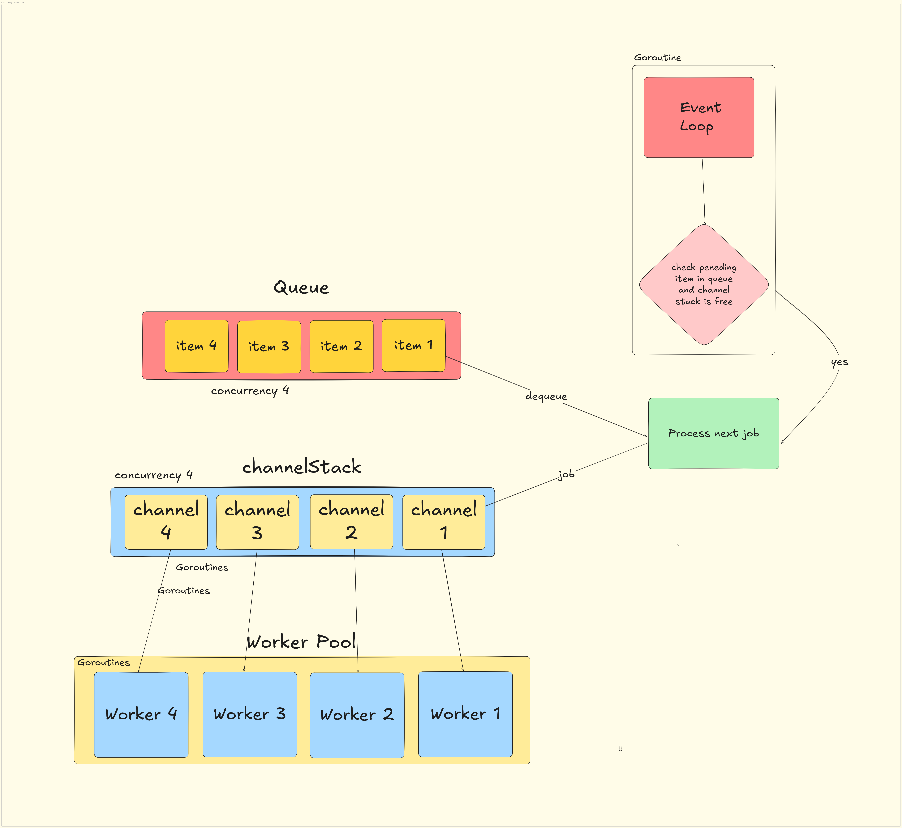
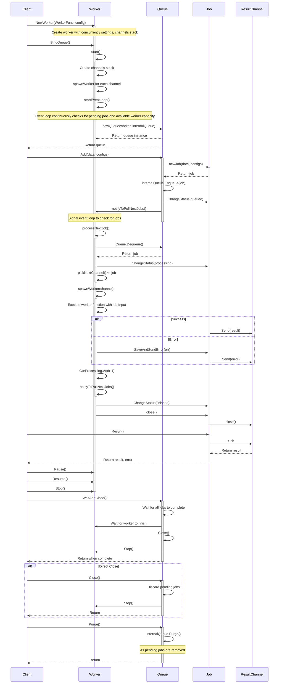

# VarMQ

[](https://pkg.go.dev/github.com/goptics/varmq)
[![DeepWiki](https://img.shields.io/badge/DeepWiki-goptics%2Fvarmq-blue.svg?logo=data:image/png;base64,iVBORw0KGgoAAAANSUhEUgAAACwAAAAyCAYAAAAnWDnqAAAAAXNSR0IArs4c6QAAA05JREFUaEPtmUtyEzEQhtWTQyQLHNak2AB7ZnyXZMEjXMGeK/AIi+QuHrMnbChYY7MIh8g01fJoopFb0uhhEqqcbWTp06/uv1saEDv4O3n3dV60RfP947Mm9/SQc0ICFQgzfc4CYZoTPAswgSJCCUJUnAAoRHOAUOcATwbmVLWdGoH//PB8mnKqScAhsD0kYP3j/Yt5LPQe2KvcXmGvRHcDnpxfL2zOYJ1mFwrryWTz0advv1Ut4CJgf5uhDuDj5eUcAUoahrdY/56ebRWeraTjMt/00Sh3UDtjgHtQNHwcRGOC98BJEAEymycmYcWwOprTgcB6VZ5JK5TAJ+fXGLBm3FDAmn6oPPjR4rKCAoJCal2eAiQp2x0vxTPB3ALO2CRkwmDy5WohzBDwSEFKRwPbknEggCPB/imwrycgxX2NzoMCHhPkDwqYMr9tRcP5qNrMZHkVnOjRMWwLCcr8ohBVb1OMjxLwGCvjTikrsBOiA6fNyCrm8V1rP93iVPpwaE+gO0SsWmPiXB+jikdf6SizrT5qKasx5j8ABbHpFTx+vFXp9EnYQmLx02h1QTTrl6eDqxLnGjporxl3NL3agEvXdT0WmEost648sQOYAeJS9Q7bfUVoMGnjo4AZdUMQku50McDcMWcBPvr0SzbTAFDfvJqwLzgxwATnCgnp4wDl6Aa+Ax283gghmj+vj7feE2KBBRMW3FzOpLOADl0Isb5587h/U4gGvkt5v60Z1VLG8BhYjbzRwyQZemwAd6cCR5/XFWLYZRIMpX39AR0tjaGGiGzLVyhse5C9RKC6ai42ppWPKiBagOvaYk8lO7DajerabOZP46Lby5wKjw1HCRx7p9sVMOWGzb/vA1hwiWc6jm3MvQDTogQkiqIhJV0nBQBTU+3okKCFDy9WwferkHjtxib7t3xIUQtHxnIwtx4mpg26/HfwVNVDb4oI9RHmx5WGelRVlrtiw43zboCLaxv46AZeB3IlTkwouebTr1y2NjSpHz68WNFjHvupy3q8TFn3Hos2IAk4Ju5dCo8B3wP7VPr/FGaKiG+T+v+TQqIrOqMTL1VdWV1DdmcbO8KXBz6esmYWYKPwDL5b5FA1a0hwapHiom0r/cKaoqr+27/XcrS5UwSMbQAAAABJRU5ErkJggg==)](https://deepwiki.com/goptics/varmq)
[](https://goreportcard.com/report/github.com/goptics/varmq)
[](https://golang.org/doc/devel/release.html)
[](https://github.com/goptics/varmq/actions/workflows/go.yml)
[](https://codecov.io/gh/goptics/varmq/)

[](LICENSE)

**VarMQ** is a high-performance message queue for Go that simplifies concurrent task processing using [worker pool](#the-concurrency-architecture). Using Go generics, it provides type safety without sacrificing performance.

With VarMQ, you can process messages asynchronously, handle errors properly, store data persistently, and scale across systems when needed. All through a clean, intuitive API that feels natural to Go developers.

This isn't meant to replace RabbitMQ or Kafka - VarMQ serves a different purpose as a lightweight, in-process message queue with strong worker management. For persistence and distribution, it offers a flexible [adapter system](./docs/API_REFERENCE.md#available-adapters) that extends its capabilities beyond simple in-memory queues.

## Features

- **⚡ High performance**: Optimized for throughput control with minimal overhead
- **🛠️ Variants of queue types**:
  - Standard queues for in-memory processing
  - Priority queues for importance-based ordering
  - Persistent queues for durability across restarts
  - Distributed queues for processing across multiple systems
- **🧩 Worker abstractions**:
  - `WorkerFunc[T, R any] func(T) (R, error)` - Returns result and error
  - `WorkerErrFunc[T any] func(T) error` - Returns only error (when result isn't needed)
  - `VoidWorkerFunc[T any] func(T)` - Fire-and-forget operations (most performant)
- **🚦 Concurrency control**: Fine-grained control over worker pool size
- **💾 Persistence**: Support for durable storage through adapter interfaces
- **🌐 Distribution**: Scale processing across multiple instances via adapter interfaces
- **🧩 Extensible**: Build your own storage adapters by implementing simple interfaces

## Quick Start

### Installation

```bash
go get github.com/goptics/varmq
```

### Basic Usage

```go
package main

import (
    "fmt"
    "time"

    "github.com/goptics/varmq"
)

func main() {
    // Create a worker that processes strings and returns their length
    worker := varmq.NewWorker(func(data string) (int, error) {
        fmt.Println("Processing:", data)
        time.Sleep(1 * time.Second) // Simulate work
        return len(data), nil
    })

    // Bind to a standard queue
    queue := worker.BindQueue()
    defer queue.WaitAndClose() // Wait for all jobs to complete and close the queue

    // Add jobs to the queue
    job1 := queue.Add("Hello")
    job2 := queue.Add("World")

    // Get results (Result() returns both value and error)
    result1, err1 := job1.Result()
    if err1 != nil {
        fmt.Println("Error processing job1:", err1)
    } else {
        fmt.Println("Result 1:", result1)
    }

    result2, err2 := job2.Result()
    if err2 != nil {
        fmt.Println("Error processing job2:", err2)
    } else {
        fmt.Println("Result 2:", result2)
    }

    // Add multiple jobs at once
    groupJob := queue.AddAll([]varmq.Item[string]{
        {Value: "Hello", ID: "1"},
        {Value: "World", ID: "2"},
    })

    resultChan, err := groupJob.Results()
    if err != nil {
        fmt.Println("Error getting results channel:", err)
        return
    }

    // Get results as they complete in real-time
    for result := range resultChan {
        if result.Err != nil {
            fmt.Printf("Error processing job %s: %v\n", result.JobId, result.Err)
        } else {
            fmt.Printf("Result for job %s: %v\n", result.JobId, result.Data)
        }
    }
}
```

## Persistent and Distributed Queues

VarMQ supports both persistent and distributed queue processing through adapter interfaces:

- **Persistent Queues**: Store jobs durably so they survive program restarts
- **Distributed Queues**: Process jobs across multiple systems

Usage is simple:

```go
// For persistent queues (with any IPersistentQueue adapter)
queue := worker.WithPersistentQueue(persistentQueueAdapter)

// For distributed queues (with any IDistributedQueue adapter)
queue := worker.WithDistributedQueue(distributedQueueAdapter)
```

See complete working examples in the [examples directory](./examples):

- [Persistent Queue Example (SQLite)](./examples/sqlite-persistent)
- [Persistent Queue Example (Redis)](./examples/redis-persistent)
- [Distributed Queue Example (Redis)](./examples/redis-distributed)

Create your own adapters by implementing the `IPersistentQueue` or `IDistributedQueue` interfaces.

> Note: Before testing examples, make sure to start the Redis server using `docker compose up -d`.

## Advanced Features

### Priority Queues

Process important jobs first:

```go
// Create a standard priority queue
queue := worker.BindPriorityQueue()

// Add jobs with priorities (lower number = higher priority)
queue.Add("High priority", 1)
queue.Add("Low priority", 10)
```

### Job Control

```go
// Add a job with custom ID
job := queue.Add("Important task", varmq.WithJobId("custom-id-123"))

// Get job status
status := job.Status()

// Get job result (blocks until job completes)
result, err := job.Result()
if err != nil {
    fmt.Println("Job failed:", err)
} else {
    fmt.Println("Result:", result)
}

// Drain the result (when you don't need it)
job.Drain()

// Get JSON representation of job
jsonData, _ := job.Json()
```

## WhyVarMQ?

- **Simple API**: Clean, intuitive interface that doesn't get in your way
- **Minimal Dependencies**: Core library has no external dependencies
- **Production Ready**: Built for real-world scenarios and high-load applications
- **Highly Extensible**: Create your own storage adapters by implementing VarMQ's internal queue interfaces
- **Built-in adapters**:
  - ⚡ Redis: [redisq](https://github.com/goptics/redisq)
  - 🗃️ SQLite: [sqliteq](https://github.com/goptics/sqliteq)
  - 🦆 DuckDB: [duckq](https://github.com/goptics/duckq)
  - 🐘 PostgreSQL: 🔄 Upcoming

## API Reference

For detailed API documentation, see the [API Reference](./docs/API_REFERENCE.md).

### Table of Contents

- [Worker Creation](./docs/API_REFERENCE.md#worker-creation)
  - [`NewWorker`](./docs/API_REFERENCE.md#newworker)
  - [`NewErrWorker`](./docs/API_REFERENCE.md#newerrworker)
  - [`NewVoidWorker`](./docs/API_REFERENCE.md#newvoidworker)
  - [Worker Configuration](./docs/API_REFERENCE.md#worker-configuration)
- [Queue Types](./docs/API_REFERENCE.md#queue-types)
  - [Standard Queue](./docs/API_REFERENCE.md#standard-queue)
  - [Priority Queue](./docs/API_REFERENCE.md#priority-queue)
  - [Persistent Queue](./docs/API_REFERENCE.md#persistent-queue)
  - [Persistent Priority Queue](./docs/API_REFERENCE.md#persistent-priority-queue)
  - [Distributed Queue](./docs/API_REFERENCE.md#distributed-queue)
  - [Distributed Priority Queue](./docs/API_REFERENCE.md#distributed-priority-queue)
- [Queue Operations](./docs/API_REFERENCE.md#queue-operations)
  - [Adding Jobs](./docs/API_REFERENCE.md#adding-jobs)
  - [Shutdown Operations](./docs/API_REFERENCE.md#shutdown-operations)
- [Worker Control](./docs/API_REFERENCE.md#worker-control)
- [Adapters](./docs/API_REFERENCE.md#adapters)
  - [Available Adapters](./docs/API_REFERENCE.md#available-adapters)
  - [Planned Adapters](./docs/API_REFERENCE.md#planned-adapters)
  - [Creating Custom Adapters](./docs/API_REFERENCE.md#creating-custom-adapters)
- [Interface Hierarchy](./docs/API_REFERENCE.md#interface-hierarchy)
- [Job Management](./docs/API_REFERENCE.md#job-management)
  - [`Job`](./docs/API_REFERENCE.md#job)

## The Concurrency Architecture



## Sequence Diagram

The following sequence diagram illustrates the main flow and interactions in the VarMQ.



## Older Versions

- [v2](https://pkg.go.dev/github.com/fahimfaisaal/gocq/v2)
- [v1](https://pkg.go.dev/github.com/fahimfaisaal/gocq)

## Contributing

Contributions are welcome! Please feel free to submit a Pull Request.

## 👤 Author

- GitHub: [@fahimfaisaal](https://github.com/fahimfaisaal)
- LinkedIn: [in/fahimfaisaal](https://www.linkedin.com/in/fahimfaisaal/)
- Twitter: [@FahimFaisaal](https://twitter.com/FahimFaisaal)
