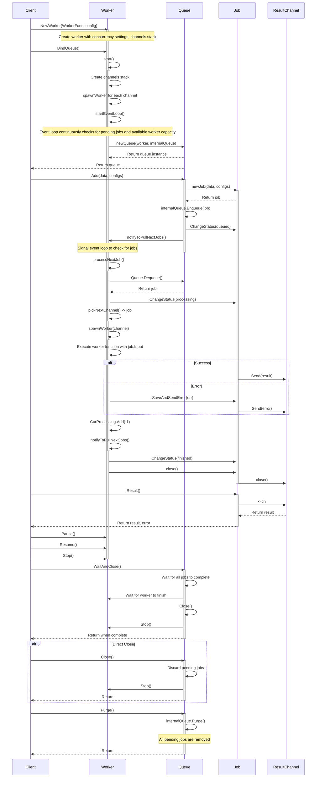

# VarMQ

[](https://pkg.go.dev/github.com/goptics/varmq)
[](https://goreportcard.com/report/github.com/goptics/varmq)
[](https://golang.org/doc/devel/release.html)
[](https://github.com/goptics/varmq/actions/workflows/go.yml)
[](https://codecov.io/gh/goptics/varmq/)

[](LICENSE)

VarMQ is a high-performance message queue for Go that handles concurrency well. It combines a message queue with worker pool management in a type-safe way using Go generics. The package helps you process messages asynchronously, handle errors properly, store data persistently, and scale across systems when needed. It does all this with a clean API that's easy to work with.

its not an another killer of rabbitMQ or kafka. its just a simple message queue with high-level worker pool management system. which provides you a real persistent and distributed queue abstraction layer using [adapters](./docs/API_REFERENCE.md#available-adapters).

## Features

- **⚡ High performance**: Optimized for throughput control with minimal overhead
- **🛠️ Variants of queue types**:
  - Standard queues for in-memory processing
  - Priority queues for importance-based ordering
  - Persistent queues for durability across restarts
  - Distributed queues for processing across multiple systems
- **🧩 Worker abstractions**:
  - `WorkerFunc` - Returns result and error
  - `WorkerErrFunc` - Returns only error (when result isn't needed)
  - `VoidWorkerFunc` - Fire-and-forget operations (most performant)
- **🚦 Concurrency control**: Fine-grained control over worker pool size
- **💾 Persistence**: Support for durable storage through adapter interfaces
- **🌐 Distribution**: Scale processing across multiple instances via adapter interfaces
- **🧩 Extensible**: Build your own storage adapters by implementing simple interfaces

## Quick Start

### Installation

```bash
go get github.com/goptics/varmq
```

### Basic Usage

```go
package main

import (
    "fmt"
    "time"

    "github.com/goptics/varmq"
)

func main() {
    // Create a worker that processes strings and returns their length
    worker := varmq.NewWorker(func(data string) (int, error) {
        fmt.Println("Processing:", data)
        time.Sleep(1 * time.Second) // Simulate work
        return len(data), nil
    })

    // Bind to a standard queue
    queue := worker.BindQueue()
    defer queue.WaitAndClose() // Wait for all jobs to complete and close the queue

    // Add jobs to the queue
    job1 := queue.Add("Hello")
    job2 := queue.Add("World")

    // Get results (Result() returns both value and error)
    result1, err1 := job1.Result()
    if err1 != nil {
        fmt.Println("Error processing job1:", err1)
    } else {
        fmt.Println("Result 1:", result1)
    }

    result2, err2 := job2.Result()
    if err2 != nil {
        fmt.Println("Error processing job2:", err2)
    } else {
        fmt.Println("Result 2:", result2)
    }

    // Add multiple jobs at once
    groupJob := queue.AddAll([]varmq.Item[string]{
        {Value: "Concurrent", ID: "1"},
        {Value: "Queue", ID: "2"},
    })

    resultChan, err := groupJob.Results()
    if err != nil {
        fmt.Println("Error getting results channel:", err)
        return
    }

    // Get results as they complete in real-time
    for result := range resultChan {
        if result.Err != nil {
            fmt.Printf("Error processing job %s: %v\n", result.JobId, result.Err)
        } else {
            fmt.Printf("Result for job %s: %v\n", result.JobId, result.Data)
        }
    }
}
```

## Persistent and Distributed Queues

VarMQ supports both persistent and distributed queue processing through adapter interfaces:

- **Persistent Queues**: Store jobs durably so they survive program restarts
- **Distributed Queues**: Process jobs across multiple systems

Usage is simple:

```go
// For persistent queues (with any IPersistentQueue adapter)
queue := worker.WithPersistentQueue(persistentQueueAdapter)

// For distributed queues (with any IDistributedQueue adapter)
queue := worker.WithDistributedQueue(distributedQueueAdapter)
```

See complete working examples in the [examples directory](./examples):

- [Persistent Queue Example](./examples/persistent)
- [Distributed Queue Example](./examples/distributed)

Create your own adapters by implementing the `IPersistentQueue` or `IDistributedQueue` interfaces.

## Advanced Features

### Priority Queues

Process important jobs first:

```go
// Create a standard priority queue
queue := worker.BindPriorityQueue()

// Add jobs with priorities (lower number = higher priority)
queue.Add("High priority", 1)
queue.Add("Low priority", 10)
```

### Job Control

```go
// Add a job with custom ID
job := queue.Add("Important task", varmq.WithJobId("custom-id-123"))

// Get job status
status := job.Status()

// Get job result (blocks until job completes)
result, err := job.Result()
if err != nil {
    fmt.Println("Job failed:", err)
} else {
    fmt.Println("Result:", result)
}

// Drain the result (when you don't need it)
job.Drain()

// Get JSON representation of job
jsonData, _ := job.Json()
```

## WhyVarMQ?

- **Simple API**: Clean, intuitive interface that doesn't get in your way
- **Minimal Dependencies**: Core library has no external dependencies
- **Production Ready**: Built for real-world scenarios and high-load applications
- **Highly Extensible**: Create your own storage adapters by implementingVarMQ's internal queue interfaces
  - Currently supports Redis via redisq adapter
  - Future plans include SQLite, PostgreSQL, DiceDB and more
  - Build your own adapters for any persistent storage system

## API Reference

For detailed API documentation, see the [API Reference](./docs/API_REFERENCE.md).

### Table of Contents

- [Worker Creation](./docs/API_REFERENCE.md#worker-creation)
  - [`NewWorker`](./docs/API_REFERENCE.md#newworker)
  - [`NewErrWorker`](./docs/API_REFERENCE.md#newerrworker)
  - [`NewVoidWorker`](./docs/API_REFERENCE.md#newvoidworker)
  - [Worker Configuration](./docs/API_REFERENCE.md#worker-configuration)
- [Queue Types](./docs/API_REFERENCE.md#queue-types)
  - [Standard Queue](./docs/API_REFERENCE.md#standard-queue)
  - [Priority Queue](./docs/API_REFERENCE.md#priority-queue)
  - [Persistent Queue](./docs/API_REFERENCE.md#persistent-queue)
  - [Persistent Priority Queue](./docs/API_REFERENCE.md#persistent-priority-queue)
  - [Distributed Queue](./docs/API_REFERENCE.md#distributed-queue)
  - [Distributed Priority Queue](./docs/API_REFERENCE.md#distributed-priority-queue)
- [Queue Operations](./docs/API_REFERENCE.md#queue-operations)
  - [Adding Jobs](./docs/API_REFERENCE.md#adding-jobs)
  - [Shutdown Operations](./docs/API_REFERENCE.md#shutdown-operations)
- [Worker Control](./docs/API_REFERENCE.md#worker-control)
- [Adapters](./docs/API_REFERENCE.md#adapters)
  - [Available Adapters](./docs/API_REFERENCE.md#available-adapters)
  - [Planned Adapters](./docs/API_REFERENCE.md#planned-adapters)
  - [Creating Custom Adapters](./docs/API_REFERENCE.md#creating-custom-adapters)
- [Interface Hierarchy](./docs/API_REFERENCE.md#interface-hierarchy)
- [Job Management](./docs/API_REFERENCE.md#job-management)
  - [`Job`](./docs/API_REFERENCE.md#job)

## The Concurrency Architecture


## Sequence Diagram

The following sequence diagram illustrates the main flow and interactions in the VarMQ.



## Contributing

Contributions are welcome! Please feel free to submit a Pull Request.

## License

This project is licensed under the MIT License - see the LICENSE file for details.
