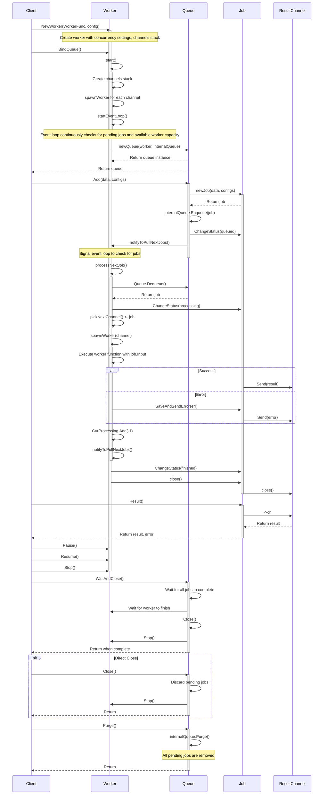

# Sequence Diagram

The following sequence diagram illustrates the main flow and interactions in the VarMQ.

```mermaid
sequenceDiagram
    participant Client
    participant Worker as Worker
    participant Queue as Queue
    participant Job as Job
    participant ResultChannel as ResultChannel

    %% Worker Creation
    Client->>Worker: NewWorker(WorkerFunc, config)
    activate Worker
    Note over Worker: Create worker with concurrency settings, channels stack

    %% Queue Binding
    Client->>Worker: BindQueue()
    Worker->>Worker: start()
    activate Worker
    Worker->>Worker: Create channels stack
    Worker->>Worker: spawnWorker for each channel
    Worker->>Worker: startEventLoop()
    Note over Worker: Event loop continuously checks for pending jobs and available worker capacity
    deactivate Worker
    Worker->>Queue: newQueue(worker, internalQueue)
    Queue-->>Worker: Return queue instance
    Queue-->>Client: Return queue

    %% Adding a Job
    Client->>Queue: Add(data, configs)
    activate Queue
    Queue->>Job: newJob(data, configs)
    activate Job
    Job-->>Queue: Return job
    Queue->>Queue: internalQueue.Enqueue(job)
    Queue->>Job: ChangeStatus(queued)
    Queue->>Worker: notifyToPullNextJobs()
    Note over Worker: Signal event loop to check for jobs
    deactivate Queue

    %% Job Processing
    Worker->>Worker: processNextJob()
    activate Worker
    Worker->>Queue: Queue.Dequeue()
    Queue-->>Worker: Return job
    Worker->>Job: ChangeStatus(processing)
    Worker->>Worker: pickNextChannel() <- job
    deactivate Worker

    Worker->>Worker: spawnWorker(channel)
    activate Worker
    Worker->>Worker: Execute worker function with job.Input
    alt Success
        Job->>ResultChannel: Send(result)
    else Error
        Worker->>Job: SaveAndSendError(err)
        Job->>ResultChannel: Send(error)
    end
    Worker->>Worker: CurProcessing.Add(-1)
    Worker->>Worker: notifyToPullNextJobs()
    deactivate Worker

    %% Job Completion
    Worker->>Job: ChangeStatus(finished)
    Worker->>Job: close()
    Job->>ResultChannel: close()
    deactivate Job

    %% Result Handling
    Client->>Job: Result()
    activate Job
    Job->>ResultChannel: <-ch
    ResultChannel-->>Job: Return result
    Job-->>Client: Return result, error
    deactivate Job

    %% Worker Control
    Client->>Worker: Pause()
    Client->>Worker: Resume()
    Client->>Worker: Stop()
    deactivate Worker

    %% Queue Shutdown
    Client->>Queue: WaitAndClose()
    activate Queue
    Queue->>Queue: Wait for all jobs to complete
    Queue->>Worker: Wait for worker to finish
    Queue->>Queue: Close()
    Queue->>Worker: Stop()
    Queue-->>Client: Return when complete
    deactivate Queue

    alt Direct Close
        Client->>Queue: Close()
        activate Queue
        Queue->>Queue: Discard pending jobs
        Queue->>Worker: Stop()
        Queue-->>Client: Return
        deactivate Queue
    end

    %% Queue Purge
    Client->>Queue: Purge()
    activate Queue
    Queue->>Queue: internalQueue.Purge()
    Note over Queue: All pending jobs are removed
    Queue-->>Client: Return
    deactivate Queue
```
